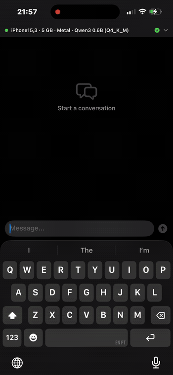

# 🦀 CrabInfer — Rust-Powered LLM Inference SDK for iOS

**Safe, fast, memory-aware on-device LLM inference for iOS apps.**

CrabInfer is a three-layer AI inference stack for iOS, built in Rust on top of [Candle](https://github.com/huggingface/candle) (Hugging Face's ML framework), exposed to Swift via [UniFFI](https://mozilla.github.io/uniffi-rs/).

## Demo

<p align="center">
  
</p>
<p align="center"><em>On-device chat running Qwen3 0.6B (Q4_K_M) on iPhone 14 Pro Max via Metal GPU — ~18-22 tok/s</em></p>

## Why CrabInfer?

Every iOS LLM app today crashes, locks up phones, or leaks memory — because iOS developers are wrapping C++ inference engines (llama.cpp) with no memory safety, no device-aware model selection, and no graceful degradation. CrabInfer solves this.

| Problem | CrabInfer Solution |
|---|---|
| Apps crash from OOM | Memory pressure manager with iOS lifecycle awareness |
| Wrong model for device | Auto-detect device RAM + GPU tier, select optimal quant |
| Phone locks up on Metal | Graceful fallback: Metal GPU → CPU NEON → smaller model |
| No context management | Automatic context compaction when hitting token limits |
| Manual model loading | mmap-based lazy loading with preemptive unloading |

## Architecture

```
┌─────────────────────────────────────────┐
│  Swift SDK (public API)                 │  ← What iOS devs import
│  CrabInfer.Engine, CrabInfer.Model      │
├─────────────────────────────────────────┤
│  Rust Core via UniFFI                   │  ← The magic layer
│  ┌─────────────────────────────────────┐│
│  │ MemoryPressureManager              ││  ← iOS memory lifecycle
│  │ DeviceCapabilityDetector           ││  ← Auto quant selection
│  │ ModelLifecycle (load/swap/unload)  ││  ← mmap, lazy loading
│  │ ContextWindowManager              ││  ← Auto compaction
│  │ GracefulDegradationChain          ││  ← GPU→CPU→fallback
│  └─────────────────────────────────────┘│
├─────────────────────────────────────────┤
│  Candle (Metal + CPU backends)          │  ← Tensor ops, GPU accel
│  GGUF model loading                     │
└─────────────────────────────────────────┘
```

## Three Layers (Shipped Independently)

1. **Layer 1: Inference Engine** — This repo. Safe on-device inference with memory management.
2. **Layer 2: Credential Manager** — Secure API key/token management for hybrid local+cloud inference.
3. **Layer 3: Agent Runtime** — On-device AI agent with App Intents, tool use, and sandboxing.

## Supported Devices

| Device | RAM | Max Model | Expected tok/s |
|---|---|---|---|
| iPhone 12 Pro+ | 6GB | 3B Q4_K_M | ~15 tok/s |
| iPhone 14 Pro+ | 6GB | 3B Q4_K_M / 7B Q2_K | ~15-18 tok/s |
| iPhone 15 Pro+ | 8GB | 7B Q4_K_M | ~11 tok/s |
| iPhone 16 Pro+ | 8GB | 7B Q4_K_M | ~14 tok/s |
| iPad Pro M1+ | 8-16GB | 13B Q4_K_M | ~8-12 tok/s |
| Mac (Apple Silicon) | 16-192GB | 70B+ | ~20-40 tok/s |

## Quick Start (Swift)

```swift
import CrabInfer

// Engine auto-detects your device and picks the best model config
let engine = try CrabInferEngine(
    modelPath: "path/to/phi-3-mini-Q4_K_M.gguf"
)

// Stream tokens
for await token in engine.generate(prompt: "Explain quantum computing simply") {
    print(token, terminator: "")
}

// Or get complete response
let response = try await engine.complete(
    prompt: "Write a haiku about Rust",
    maxTokens: 100,
    temperature: 0.7
)
```

## Project Structure

```
crabinfer/
├── crabinfer-core/          # Rust: inference engine, memory management
│   ├── src/
│   │   ├── lib.rs           # UniFFI bridge definitions
│   │   ├── engine.rs        # Core inference engine
│   │   ├── memory.rs        # Memory pressure management
│   │   ├── device.rs        # Device capability detection
│   │   └── model.rs         # Model loading and lifecycle
│   ├── Cargo.toml
│   └── src/bin/
│       └── uniffi-bindgen.rs
├── crabinfer-swift/         # Swift package wrapping the Rust core
│   ├── Package.swift
│   └── Sources/
│       └── CrabInfer/
├── examples/
│   └── ios-demo/            # SwiftUI demo app
├── build.sh                 # Build script for XCFramework
└── README.md
```

## Building

### Prerequisites

```bash
# Install Rust iOS targets
rustup target add aarch64-apple-ios aarch64-apple-ios-sim

# Ensure you have Xcode command line tools
xcode-select --install
```

### Build

```bash
# Build the Rust core for iOS
./build.sh

# Open the demo app
open examples/ios-demo/CrabInferDemo.xcodeproj
```

## Development Status

🚧 **Proof of Concept** — This is the starting point. Contributions welcome.

- [x] Project structure and architecture
- [x] UniFFI bridge definition
- [x] Basic inference engine skeleton
- [x] Memory pressure manager skeleton
- [x] Device capability detector
- [ ] Candle integration with Metal backend
- [ ] GGUF model loading
- [ ] Token streaming
- [ ] Context window management
- [ ] Graceful degradation chain
- [ ] Swift Package distribution
- [ ] TestFlight demo app

## License

Apache-2.0 — Same as Candle and crabml.

## Credits

- [Candle](https://github.com/huggingface/candle) by Hugging Face — tensor operations and Metal backend
- [crabml](https://github.com/crabml/crabml) — inspiration for Rust + GGUF + SIMD approach
- [UniFFI](https://mozilla.github.io/uniffi-rs/) by Mozilla — Rust ↔ Swift bridge

---

**CrabInfer** is a [Specianic](https://specianic.io) project.
# crabinfer
